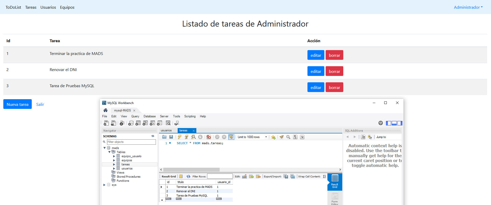
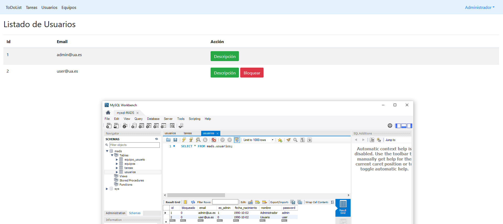
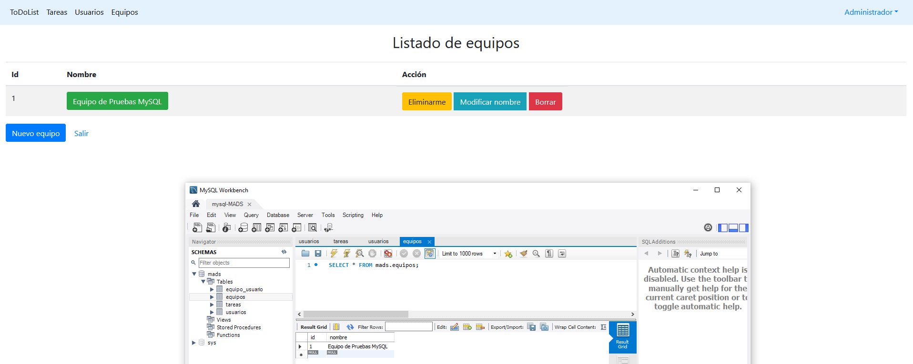
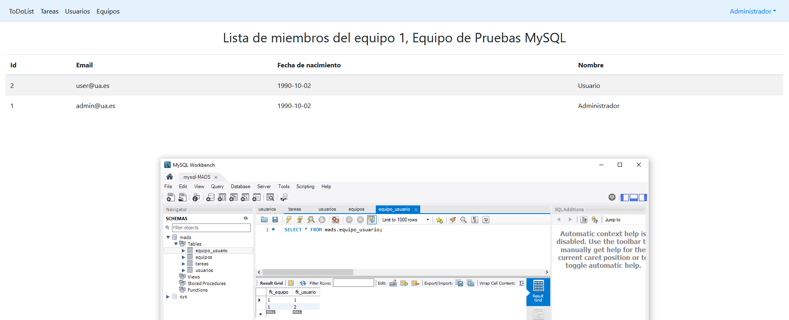

# Documentación Practica 2 #

En el presente documento se hará una explicación de los cambios que hemos añadidos desde la version 1.1.0 (concretamente para las historias de usuario 009 y 010).
La explicación se hara en cinco apartados para cada historia de usuario. Son los siguientes:
- Pantalla de la base de datos MySQL.
- Listado de nuevas clases y métodos implementados y breve explicación.
- Listado de plantillas thymeleaf modificadas y breve explicación.
- Tests implementados.
- Explicación de algunos fragmentos de código fuente de ciertas partes interesantes en las nuevas funcionalidades implementadas.
## Historia de usuario 009 Gestionar pertenencia al equipo ##

La gestión de pertenencia al equipo permite a un usuario crear nuevos equipos y añadirse o eliminarse de cualquiera de ellos para poder participar y dejar de participar en ellos.
### Pantalla de la base de datos MySQL. ###
Ejecutando el comando _./mvnw spring-boot:run -Dspring.profiles.active=mysql_ pondremos la aplicación en funcionamiento sobre la base da datos MySQL. Esta base datos esta virtualizada en una maquina docker. 
 
A continuación, podemos ver que los datos que nuestra aplicación contiene se corresponden con los del servidor MySQL:



Ocurre lo mismo con los datos de los usuarios:



También con los equipos:



Y con los usuarios de este:




### Listado de nuevas clases y métodos implementados ###
A continuación, se nombrarán las nuevas clases, métodos de éstas que se han implementado y cual es su finalidad.
- service/EquipoServiceException: Es una clase Exception que se utilizara en EquipoService cuando ocurra algún error en esa clase.
- service/EquipoService.java:
    - crearEquipo(nombre): Este método recibe un String y crea un equipo con el nombre de ese string. Este nuevo equipo se guarda en la base de datos utilizando el metodo .save() de la clase EquipoRepository.
    - aniadirUsuarioAEquipo(idUsuario, idEquipo): Este método recibe el id de un usuario y de un equipo, y asocia ese usuario a ese equipo y viceversa. Se guarda en la base de datos.
    - borrarUsuarioDeEquipo(idUsuario, idEquipo): Este método recibe el id de un usuario y de un equipo, y quita la asociación existente entre ese equipo y el usuario y viceversa. Los cambios se guardan en la base de datos.

- controller/EquipoData.java: Es el objeto que se le pasa a la URL de crear equipo para insertar los datos en el.
- controller/EquipoController: 
    - nuevoEquipo (GET: "equipos/nuevo"): URL accesible para cualquier usuario registrado. Se accede desde el botón `Nuevo equipo` de la URL /equipos. Este método recibe el siguiente parámetro: **@ModelAttribute EquipoData equipoData**. Este atributo se le pasará a la vista para poder introducir los datos del formulario en él. 
    - formNuevoEquipo (POST: "equipos/nuevo"): URL accesible para cualquier usuario registrado. Se accede desde el botón `Crear equipo` desde la URL /equipos/nuevo. Accede a la variable **@ModelAttribute EquipoData equipoData** para recoger los datos del formulario y posteriormente utilizar un método de EquipoServicio para crear el equipo (este método está explicado unas líneas más arriba).
    - incorporarUsuarioAEquipo (POST: "/equipos/{id}/gestionpertenencia"): URL accesible para cualquier usuario registrado. Se accede desde el botón `Añadirme/Eliminarme` desde la URL /equipos. Si el usuario no está en el equipo seleccionado se borrará de él. O por el contrario, si el usuario no está en el equipo se añadirá a ál. El borrado o añadir lo gestiona la clase EquipoServicio utilizando los métodos de esta clase que se han explicado anteriormente.
   
### Listado de plantillas thymeleaf nuevas o modificadas ###
En este apartado expondremos las plantillas thymeleaf que hemos creado o modificado para añadir esta funcionalidad.
- fragments.html
    - Esta vista contiene ahora un nuevo botón que redirige a la URL "/equipo".
    
- equipos.html
    - Esta vista ahora contiene un nuevo botón en la parte inferior de la lista de equipos que redirige a la URL "equipos/nuevo".
    - Se ha añadido la columna Acción que permite añadir/eliminar al usuario de ese equipo. Si el usuario ya pertenece al equipo el botón mostrará el texto 'Eliminarme'. Si el usuario no pertenece al equipo el botón mostrará el texto 'Añadirme'. Este botón redirige con POST.
    
- formNuevoEquipo.html (nueva plantilla).
    - Esta vista muestra el formulario necesario para crear un equipo. Contiene el campo Nombre para el equipo. 
    - Tiene un botón que redirige con POST para crear el equipo.
    
### Tests implementados ###
En esta sección listaremos y explicaremos brevemente los tests implementados.

- EquipoServiceTest
    - crearNuevoEquipo: Este test llama directamente al metodo EquipoService.crearEquipo(nombre) y comprueba que ahora la lista de equipos tiene 3 elementos (2 que ya tenia el test y 1 que hemos creado). Además, comprueba el nombre de éstos.
    - aniadirUsuarioAEquipo: Este test llama al método EquipoService.aniadirUsuarioAEquipo(idUsuario, idEquipo) que añade el usuario 1 al equipo 2 (ambos existentes en la base de datos y el equipo no tenía usuarios asignados). Después, obtiene la lista de usuarios del equipo 2 (anteriormente vacío) y comprueba que tiene tamaño 1 y su usuario tiene email "ana.garcia@gmail.com". También, comprueba que la lista de equipos del usuario 1 (anteriormente solo tenia 1 equipo) ahora tiene tamaño 2 y comprueba sus nombres.
    - borrarUsuarioDeEquipo: Este test llama al método EquipoService.borrarUsuarioDeEquipo(idUsuario, idEquipo) que borra el usuario 1 del equipo 1 (este equipo sólo tiene este usuario asociado). Después, obtiene la lista de usuarios del equipo 1 y comprueba que su tamaño ahora es 0. También, comprueba que la lista de usuarios del equipo 1 es 0.
 
### Explicación de fragmentos de código relevantes ###
En este apartado se explicarán algunos fragmentos relevantes para la implementación de la funcionalidad desarrollada.

- 'Añadirme/Eliminarme' 

El botón de la vista contiene estas etiquetas:
```
<form method="post" th:action="@{/equipos/{id}/gestionpertenencia(id=${equipo.id})}">
    <button type="submit" th:class="${!equipo.getUsuarios().contains(usuario)} ? 'btn btn-primary btn-xs' : 'btn btn-warning'"
                          th:text="${!equipo.getUsuarios().contains(usuario)} ? 'Añadirme' : 'Eliminarme'">
    </button>
</form>
```

Este botón cambia de texto y class dinámicamente dependiendo de si el usuario actualmente logeado pertenece o no al equipo.
Si el usuario no está en el equipo el botón tiene la propiedad class="btn btn-primary btn-xs", y si no está tendrá class="btn btn-warning".
Si el usuario no está en el equipo el botón mostrará el texto "Añadirme", y si no está mostrara el texto "Eliminarme".

Si pasamos al método del controller que gestiona este POST nos encontramos con lo siguiente:
```
if(listaUsuariosEquipo.contains(usuarioLogueado)){
    equipoService.borrarUsuarioDeEquipo(usuarioLogueado.getId(), equipo.getId());
    flash.addFlashAttribute("mensaje", "Has sido eliminado del equipo" + equipo.getId() + ", " + equipo.getNombre());
}else{ //si no esta ya en el equipo, hay que añadirlo
    equipoService.aniadirUsuarioAEquipo(usuarioLogueado.getId(), equipo.getId());
    flash.addFlashAttribute("mensaje", "Has sido añadido al equipo " + equipo.getId() + ", " + equipo.getNombre());
}
```
Esta sentencia de controler comprueba si el usuario ya está en el equipo o no.
Si el usuario ya en el equipo llama al método de servicio para borrar este usuario del equipo y añade un mensaje en la vista.
Si el usuario no está en el equipo llama al método de servicio de añadir y envía un mensaje a la vista.

Y si nos vamos a los métodos de servicio de añadir nos encontramos con el siguiente código:
```
usuario.getEquipos().add(equip);
equip.getUsuarios().add(usuario);
```
Para añadir un usuario a un equipo debemos actualizar tanto la lista de equipos del usuario como la lista de usuarios del equipo. Es una caracteristica del framework utilizado, con otros frameworks bastaría con añadirlo en uno de los.

Por otro lado, ocurriría lo mismo con el metodo de borrar:
```
usuario.getEquipos().remove(equip);
equip.getUsuarios().remove(usuario);
```

## Historia de usuario 010 Gestión de equipos ##
La gestión del equipo es una funcionalidad únicamente para el usuario administrador. Esta funcionalidad permite al usuario administrador cambiar el nombre y eliminar equipos para así adaptarlos a los proyectos y estructura de la empresa.

### Listado de nuevas clases y metodos implementados ###
Como en el apartado de la historia de usuario 009, a continuacion, mostraremos los nuevos métodos implementados:

- service/EquipoService.java
    - borrarEquipo(idEquipo): Este metodo recibe el id de un equipo y primero borra la relación entre él y los usuarios añadidos con la función borrarUsuarioDeEquipo(idUsuario, idEquipo) explicada en la historia de usuario 009, después se borra el equipo.
    - cambiarNombreEquipo(idEquipo, nuevoNombre): Este método recibe el id de un equipo y se sustituye el nombre por lo que contiene el parametro de entrada nuevoNombre.
    
- controller/EquipoController:
    - formModificarNombreEquipo (GET: "/equipos/{id}/modificacion"): URL solo accesible para el usuario administrador. Se accede desde el botón  `Modificar nombre` de la URL /equipo en la columna Acción de cada uno de los equipos mostrados. Este método recibe un parámetro id en la URL que hace referencia al id del equipo seleccionado. También, recibe el parámetro **@ModelAttribute EquipoData equipoData** que se le pasará a la vista que devuelve para que pueda introducir los datos del formulario en este objeto.
    - modificarNombreEquipo (POST: "/equipos/{id}/modificacion"): URL solo accesible para el usuario administrador. Se accede desde el botón `Modificar equipo` situado en la URL /equipos/{id}/modificacion. Accede a la variable **@ModelAttribute EquipoData equipoData** para recoger los datos introducidos en el formulario y posteriormente utilizar un método de EquipoServicio para modificar el equipo (este método está explicado mas arriba)
    - borrarEquipo (DELETE: "/equipos/{id}"): URL solo accesible para le usuario administrador. Se accede desde el popup que aparece tras hacer click en el botón `Borrar` de la URL /equipos, en la columna Acción.  Este metodo recibe un parámetro id en la URL  que hace referencia al id del equipo que se ha seleccionado. Se hace el borrado del equipo llamando al método de EquipoServicio borrarEquipo(idEquipos).
    
### Listado de plantillas thymeleaf nuevas o modificadas ###

Para añadir esta nueva funcionalidad se han modificado o creado las siguientes plantillas thymeleaf:

- equipo.html
    - Si usuario logueado es de tipo administrador, esta vista ahora tiene dos botones adicionales en la columna Acción de la lista de los equipos. 
    - Los botones son `Modificar nombre` (redirige con GET a la URL "equipos/{id}/modificacion") y `Borrar` (tiene un script asociado al evento onclick, el cual muestra un popup para pedir una confirmación de borrado y si se hace click en aceptar lanza el método DELETE contra la URL "/equipos/{id}").

- formModificarNombreEquipo.html 
    - Esta vista muestra el formulario necesario para modificar un equipo existente. Contiene el campo Nombre para el equipo.
    - Tiene un botón que redirige con POST para modificar el equipo.
    
### Tests implementados ###

- EquipoServiceTest.java
    - borrarEquipo: Este test, primeramente obtiene la lista de usuarios del equipo 1. Después borra ese equipo y obtiene la lista de todos los equipos en la base de datos. Comprueba que la lista de usuarios del equipo 1 (anteriormente) ahora esta vacia. También, comprueba que la lista de equipos ahora tiene tamaño 1 (inicialmente tenia tamaño 2).
    - cambiarNombreEquipo: Este test, modifica directamente el nombre del equipo 1 (inicialmente llamado "Proyecto P1"). Luego, obtiene el equipo con id 1 y comprueba que su nombre es "Nombre modificado".
    
### Explicación de fragmentos de código más relevantes ###

Los fragmentos de código más interesantes son los relacionados con los nuevos botones de la vista /equipos cuando se accede con el usuario administrador.

``` 
<div th:if="${usuario.getesAdmin()}" class="btn-group">
    <a style="margin-left: 5px" class="btn btn-info" th:href="@{/equipos/{id}/modificacion(id=${equipo.id})}">Modificar nombre</a>
    <button class="btn btn-danger" onmouseover="" style="cursor: pointer; margin-left: 5px"
            th:onclick="'del(\'/equipos/' + ${equipo.getId()} + '\')'">Borrar</button>
</div>
```
Este código crea una etiqueta div solo si el usuario que accede a la URL es de tipo administrador (th:if).

El botón de `Modificar nombre` es una redirección con parametros.

El botón de `Borrar` tiene asociado al event onclick una función javascript (definida en la parte final del documento html).

Esta función contiene lo siguiente:
```
function del(urlBorrar) {
    if (confirm('¿Estás seguro/a de que quieres borrar el equipo?')) {
        $.ajax({
            url: urlBorrar,
            type: 'DELETE',
            success: function (results) {
                //refresh the page
                location.reload();
            }
        });
    }
}
```
Esta función hace aparecer un popup de confirmación. Si se hace click en aceptar, manda una petición DELETE contra la URL que contiene la variable urlBorrar. Esta variable se construye dinámicamente según el id del equipo que se ha seleccionado.

